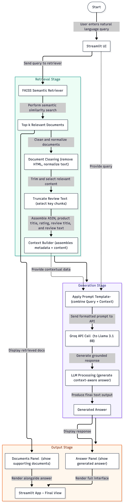

# Amazon Review Search

An information retrieval system for Amazon Digital Music reviews, supporting both **BM25 keyword search** and **semantic search** via sentence embeddings.

## Project Overview

This project explores retrieval methods on the [Amazon Reviews 2023](https://amazon-reviews-2023.github.io/) dataset (Digital Music category). It implements:

- **BM25** — keyword-based retrieval using tokenized reviews
- **Semantic Search** — dense retrieval using `all-MiniLM-L6-v2` embeddings and FAISS vector index
- **Interactive App** — Streamlit app with search and RAG-based question answering
- **RAG Pipeline** — Retrieval-Augmented Generation using semantic retrieval + Groq LLM (Llama 3.1)

## Repository Structure
```
DSCI_575_project_shrijaa_csasi/
│
├── README.md
├── requirements.txt
├── environment.yml
│
├── data/
│ ├── raw/ # downloaded .jsonl.gz files (gitignored)
│ └── processed/ # parquet files, BM25 index, FAISS index
│
├── notebooks/
│ ├── milestone1_exploration.ipynb # EDA, preprocessing, LangChain docs
| └── milestone2_rag.ipynb # RAG experiments and prompt evaluation
│
├── img/
| └── 575_workflow_diagram.png
|
├── src/
│ ├── utils.py # shared document loading and text preprocessing
│ ├── bm25.py # BM25 retriever (build, save, load, search)
│ ├── semantic.py # Semantic retriever (FAISS + embeddings)
| ├── hybrid.py # Semantic + BM25 retrievers
| ├── rag_pipeline.py # RAG pipeline (retrieval + generation)
│ └── prompts.py # prompt templates for RAG
│
├── results/
│ ├──milestone1_discussion.md # qualitative evaluation of retrieval methods
| └── milestone2_discussion.md # RAG evaluation and prompt comparison
│
└── app/
  ├── app.py # Streamlit search app
  ├── rag_mode.py
  └── search_mode.py

```

## Setup

### Prerequisites

-   [`conda`](https://docs.conda.io/projects/conda/en/latest/user-guide/install/index.html) (version 26.1.0 or higher)
-   Python and packages listed in [`requirements.txt`](requirements.txt)

### Instructions

1.  Open terminal and run the following commands.

3.  Clone the repository:

    ```bash
    git clone https://github.com/UBC-MDS/DSCI_575_project_shrijaa_csasi.git
    cd DSCI_575_project_shrijaa_csasi
    ```

4.  Create and activate the conda environment:

    ```bash
    conda env create -f environment.yml
    conda activate search-app
    ```

### Environment Variables
Create a `.env` file in the project root:
```
GROQ_API_KEY=<your_key_from_https://console.groq.com>
```

## Data Pipeline

Run the following steps in order. All outputs are saved to data/processed.

#### Step 1 - EDA and Data Preparation
Open and run all cells in the notebook:
```
jupyter lab notebooks/milestone1_exploration.ipynb
```
This downloads 20k records from the Amazon Reviews 2023 API, builds a stratified sample, applies text preprocessing, and saves `documents.parquet`.

#### Step 2 - Build BM25 index
```
python -m src.bm25
```
Saves `bm25_index.pkl` and `bm25_corpus.pkl`.

#### Step 3 - Build FAISS semantic index
```
python -m src.semantic
```
Saves faiss_index (`index.faiss` + `index.pkl`).

## Running the App
From the project root:
```
streamlit run app/app.py --server.fileWatcherType none
```
**The app provides:**

- **BM25 mode** — keyword-based search with rank-based scoring  
- **Semantic mode** — embedding-based search with similarity scores  
- **RAG mode** — context-aware answer generation using retrieved reviews  
- 👍 / 👎 feedback stored to `feedback.csv`  

##  RAG Pipeline

This project extends search with a **Retrieval-Augmented Generation (RAG)** pipeline.

- **Retrievers**: Semantic (FAISS), BM25, and Hybrid (combined + deduplicated results)  
- **Context Building**: Cleans and structures top-5 reviews into a prompt-ready format  
- **Prompting**: Templates defined in `src/prompts.py`  
- **LLM**: Groq API (`llama-3.1-8b-instant`) for answer generation  
- **Pipeline**: Implemented in `src/rag_pipeline.py` using LCEL  

### App Updates
- Tab-based UI: `Search` / `RAG`  
- Generated answer shown above retrieved documents  
- Users can verify results via product links: `amazon.com/dp/<ASIN>`

## RAG Workflow



## Dataset:
- Source: [Amazon Reviews 2023](https://amazon-reviews-2023.github.io/) dataset (Digital Music category)
- Category: Digital Music
- Files used:
  - Digital_Music.jsonl.gz — user reviews, ratings, votes
  - meta_Digital_Music.jsonl.gz — product titles, descriptions, features, price
